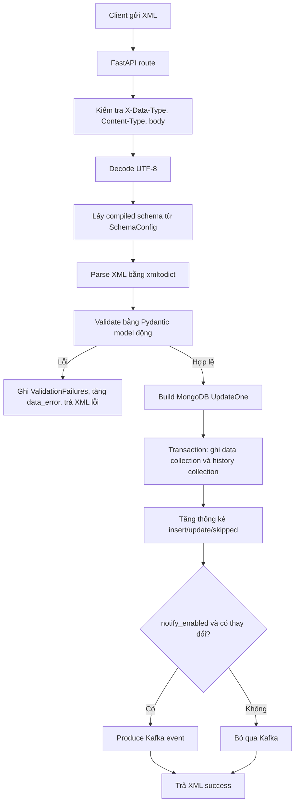

# Tài liệu logic source code ApiIntegrationIngestor

## 1. Mục đích hệ thống

`ApiIntegrationIngestor` là service FastAPI dùng để tiếp nhận dữ liệu XML từ hệ thống bên ngoài, kiểm tra dữ liệu theo schema cấu hình động trong MongoDB, ghi dữ liệu hợp lệ vào MongoDB, ghi lịch sử đồng bộ, thống kê kết quả xử lý và phát sự kiện Kafka nếu cấu hình cho phép.

Service hỗ trợ hai chế độ tiếp nhận:

- `POST /api/v1/integration/ingest/batch`: nhận một XML chứa nhiều bản ghi `<Root>` trong `<DanhSach>`.
- `POST /api/v1/integration/ingest/stream`: nhận một XML chứa một bản ghi.

Ngoài ra service có endpoint:

- `GET /api/v1/health`: kiểm tra trạng thái MongoDB và Kafka.

## 2. Thành phần chính

| Thành phần | File | Vai trò |
| --- | --- | --- |
| FastAPI app/lifespan | `src/main.py` | Khởi tạo app, thread pool, MongoDB, Kafka, schema cache, statistic service và health loop |
| Integration route | `src/routes/integration.py` | Nhận request, kiểm tra header/content-type/body, gọi validate, ghi DB, produce Kafka, trả response |
| ValidateSchemaService | `src/services/validate_schema_service.py` | Parse XML, lấy schema đã compile, validate bằng Pydantic model động, lưu lỗi validate |
| SchemaConfig | `src/utils/schema_config.py` | Poll `JobConfig` và `SchemaDefinition` từ MongoDB, compile schema thành Pydantic model và cache |
| ProcessDataService | `src/services/process_data_service.py` | Build MongoDB upsert operation, ghi dữ liệu chính và lịch sử trong transaction |
| KafkaService | `src/services/kafka_service.py` | Quản lý Kafka producer, transform record và gửi message |
| StatisticService | `src/services/statistic_service.py` | Gom thống kê trong memory buffer và định kỳ flush sang MongoDB |
| DatabaseManager | `src/core/configs/database_config.py` | Quản lý MongoDB clients cho data DB, job DB và analytics DB |
| Exception handlers | `src/core/handlers/*` | Chuẩn hóa response lỗi XML |
| Custom log middleware | `src/core/middlewares/custom_log.py` | Tạo `request_id`, đo thời gian xử lý và log request |

## 3. Luồng khởi động ứng dụng

Khi FastAPI chạy, `lifespan` trong `src/main.py` thực hiện các bước:

1. Tạo `ThreadPoolExecutor` với số worker lấy từ `INGEST_WORKERS`.
2. Kết nối các MongoDB client thông qua `DatabaseManager.connect_all()`.
3. Khởi tạo Kafka producer bằng `kafkaService.ensure_producer()`.
4. Khởi động `SchemaConfig` để load schema lần đầu từ MongoDB:
   - Đọc collection `JobConfigCDDHs`.
   - Lấy schema hiện hành từ `SchemaDefinitionCDDHs`.
   - Compile schema JSON thành Pydantic model.
   - Cache schema theo `datatype_name` và `topic_name`.
5. Khởi động `StatisticService` để flush thống kê định kỳ.
6. Tạo background task `_health_check_loop()` để kiểm tra MongoDB/Kafka định kỳ.

Khi shutdown, service dừng health task, dừng poll schema, flush thống kê, đóng MongoDB, flush Kafka producer và tắt executor.

## 4. Middleware và request tracking

Mọi request đi qua `custom_log_middleware`:

1. Sinh `request_id` dạng UUID hex và lưu vào `request.state.request_id`.
2. Gọi handler tương ứng.
3. Sau khi xử lý xong, log:
   - `trace_id`
   - client
   - method
   - path
   - status code
   - `data_type`
   - thời gian xử lý
   - chi tiết lỗi nếu có

`request_id` này được dùng xuyên suốt trong log, response lỗi và response thành công.

## 5. Luồng ingest batch

Endpoint: `POST /api/v1/integration/ingest/batch`

### 5.1. Kiểm tra request đầu vào

Hàm `_extract_request_data()` kiểm tra:

1. Header `X-Data-Type` bắt buộc có giá trị.
2. `Content-Type` phải là `application/xml` hoặc `text/xml`.
3. Body sau khi trim không được rỗng.

Nếu lỗi, service raise `AppException` và trả XML response lỗi.

### 5.2. Decode XML

Body bytes được decode bằng UTF-8 qua `xml_binary_to_string()`.

Nếu payload không phải UTF-8, service trả lỗi:

- HTTP `400`
- `errorType = XMLPARSING`
- message: `XML payload phải được encode UTF-8`

### 5.3. Validate schema batch

Route gọi:

```python
validateSchemaService.validate_schema_batch(...)
```

Logic validate batch:

1. Lấy compiled schema theo `X-Data-Type` từ `SchemaConfig.get_schema(data_type)`.
2. Parse XML bằng `xmltodict.parse()`.
3. Với batch, service lấy danh sách bản ghi từ:

```text
DanhSach.Root
```

4. Nếu không có bản ghi `<Root>`, trả lỗi dữ liệu.
5. Kiểm tra số lượng `<Root>` không vượt `ROOT_LIST_MAX_ITEMS`.
6. Validate từng bản ghi bằng Pydantic model động:

```python
compiled_schema.pydantic_model.model_validate(root_item)
```

Batch đang dùng cơ chế fail-fast: nếu một bản ghi validate lỗi, service dừng ngay tại bản ghi đầu tiên lỗi, ghi lỗi vào collection `ValidationFailures`, tăng thống kê `data_error` và trả lỗi cho client.

### 5.4. Ghi MongoDB

Nếu validate thành công, route gọi:

```python
processDataService.batch_insert_update(...)
```

Logic ghi:

1. Lấy target database/collection từ `compiled_schema`.
2. Đảm bảo target collection tồn tại.
3. Đảm bảo index unique trên `IdBanGhi`.
4. Đảm bảo history collection tồn tại.
5. Build danh sách `UpdateOne` cho từng record.

Mỗi record được lấy dữ liệu theo cấu trúc:

```text
Root.DuLieuTiepNhan
Root.TrangThaiDuLieu
Root.NguonDuLieu
```

Document ghi vào target collection gồm:

- toàn bộ dữ liệu trong `DuLieuTiepNhan`
- `PhienBan`
- `MaLoaiDuLieu`
- `IdNguonDuLieu`
- `Root_TrangThaiDuLieu`
- `schema_version`
- `is_deleted`
- `created_at`
- `updated_at`

Rule xử lý version:

```python
filter={
    "IdBanGhi": id_ban_ghi,
    "PhienBan": {"$lt": version}
}
```

Nghĩa là service chỉ insert/update khi version mới lớn hơn version hiện tại. Nếu `IdBanGhi` đã tồn tại nhưng version gửi lên không lớn hơn, MongoDB có thể phát sinh duplicate key do unique index và service trả lỗi conflict `409`.

### 5.5. Ghi history trong transaction

Service dùng MongoDB transaction:

1. Bulk write vào target collection.
2. Insert history records vào history collection.

History record gồm:

- `schema_version`
- `business_id`
- `version`
- `is_sync`
- `action`
- `db_operation`
- `topic_name`
- `conflict_reason`
- `attempted_at`
- `created_at`
- `updated_at`

Nếu transaction lỗi, service trả lỗi server `500`.

### 5.6. Thống kê

Sau khi ghi thành công, service tăng thống kê theo key:

```text
datatype_name|topic_name|organization|schema_version|hour
```

Các counter có thể tăng:

- `insert`
- `update`
- `skipped`

`StatisticService` gom thống kê trong memory và flush định kỳ vào collection analytics.

### 5.7. Produce Kafka

Sau khi ghi MongoDB, nếu schema có:

```python
compiled_schema.notify_enabled == True
```

và có insert/update, route produce Kafka cho các record đã xử lý.

Kafka message không gửi toàn bộ record mà transform thành document gọn:

```json
{
  "ServiceCode": "...",
  "IdBanGhi": "...",
  "PhienBan": "...",
  "LastModifiedAt": "..."
}
```

Lưu ý: lỗi produce Kafka được log nhưng không rollback kết quả ghi MongoDB trong route batch.

### 5.8. Response thành công

Response thành công là XML, gồm:

- `status = 200`
- `message`
- `responseTime`
- `requestId`
- `total`
- `inserted`
- `updated`
- `store`
- `dataType`

## 6. Luồng ingest stream

Endpoint: `POST /api/v1/integration/ingest/stream`

Luồng stream gần giống batch, khác ở các điểm:

1. XML đại diện cho một record duy nhất.
2. Validate bằng:

```python
validateSchemaService.validate_schema_stream(...)
```

3. Không tách danh sách `DanhSach.Root`.
4. Ghi DB bằng:

```python
processDataService.stream_insert_update(...)
```

5. Nếu `notify_enabled = True` và có insert/update, service produce đúng một Kafka message.

Nếu validate lỗi, service ghi failure với `processing_mode = STREAM`.

## 7. Cơ chế schema động

Schema validate không hard-code trong source code. Service lấy schema từ MongoDB:

- Job config collection: mặc định `JobConfigCDDHs`
- Schema definition collection: mặc định `SchemaDefinitionCDDHs`

Mỗi job config cung cấp các thông tin chính:

- `datatype_name`: dùng để lookup theo header `X-Data-Type`
- `topic_name`
- `target_database_name`
- `target_collection`
- `target_history_collection`
- `database_history`
- `source_version_number`
- `organization`
- `notify_enabled`
- `target_topic`
- `current_schema_version_id`
- `is_active`

`SchemaConfig` poll định kỳ theo `SCHEMA_DEFINITION_POLL_INTERVAL`. Lần đầu load toàn bộ job config, các lần sau chỉ lấy document có `updated_at > last_poll`.

Sau khi load, mỗi schema được compile thành `CompiledSchema`, gồm:

- metadata đích ghi MongoDB/Kafka
- Pydantic model động
- danh sách field dạng array để hỗ trợ parse XML đúng kiểu list

## 8. Rule validate schema

File `src/utils/schema_ulti.py` tạo Pydantic model từ schema definition.

Các rule đang hỗ trợ:

- `required`
- `type`: string, integer, float, boolean, object, array
- `enum`
- `constant`
- `pattern`
- `format` custom như `YYYY`, `MM`, `DD`, `HH`, `MI`, `SS`
- `minLength`, `maxLength`
- `minValue`, `maxValue`
- `minItems`
- object lồng nhau
- array item là primitive hoặc object
- `anyOf` dạng một trong các nhóm field bắt buộc

Với XML array, service dùng `force_list_callback()` để ép các path array thành list khi parse XML bằng `xmltodict`.

## 9. Xử lý lỗi validate

Khi parse XML hoặc validate schema lỗi, service ghi document vào analytics collection `ValidationFailures`.

Thông tin lỗi validate thường gồm:

- `job_type`
- `schema_version`
- `error_type`
- `error_message`
- `topic_name`
- `record_index`
- `id_ban_ghi`
- `processing_mode`
- `failed_at`
- `created_at`
- `validation_errors`
- `parsed_data`

Thông điệp lỗi trả về client được rút gọn từ lỗi Pydantic đầu tiên:

- Missing field
- String quá ngắn/quá dài
- Sai pattern
- Các lỗi validate khác

## 10. Cơ chế ghi dữ liệu và conflict version

Service ghi dữ liệu bằng `UpdateOne` với `upsert=True`.

Điều kiện update:

```text
IdBanGhi trùng và PhienBan hiện tại nhỏ hơn PhienBan mới
```

Các trường bắt buộc để build operation:

- `Root.DuLieuTiepNhan`
- `Root.DuLieuTiepNhan.IdBanGhi`
- `Root.TrangThaiDuLieu.PhienBan`

Nếu thiếu các trường này, service trả lỗi dữ liệu.

Nếu bản ghi đã tồn tại với cùng hoặc version lớn hơn, unique index trên `IdBanGhi` làm upsert thất bại với duplicate key. Service chuyển lỗi này thành:

- HTTP `409`
- `errorType = VERSION_CONFLICT`
- message: `Phiên bản của bản ghi phải lớn hơn phiên bản hiện tại.`

## 11. Kafka logic

Kafka producer được tạo lazy singleton trong `KafkaService`.

Cấu hình Kafka lấy từ environment:

- `KAFKA_BOOTSTRAP_SERVERS`
- `KAFKA_SECURITY_PROTOCOL`
- `KAFKA_SASL_MECHANISM`
- `KAFKA_SASL_USERNAME`
- `KAFKA_SASL_PASSWORD`
- `KAFKA_CA_CERT_PATH`
- `KAFKA_REQUEST_TIMEOUT_MS`
- `KAFKA_DELIVERY_TIMEOUT_MS`

Producer config chính:

- `acks = all`
- `retries = 3`
- `max.in.flight.requests.per.connection = 1`
- request/delivery timeout theo env

Khi produce, service:

1. Transform validated record thành payload Kafka.
2. Serialize JSON UTF-8.
3. Gửi vào `compiled_schema.target_topic`.
4. Flush producer để biết message đã được delivery hay chưa.

## 12. Health check

Endpoint `/api/v1/health` chạy check MongoDB và Kafka song song bằng executor:

- MongoDB: gọi `DatabaseManager.check_connection()`, ping data/job/analytics client.
- Kafka: dùng `AdminClient.list_topics(timeout=1)`.

Kết quả overall:

- `HEALTHY`: tất cả dependency healthy.
- `DOWN`: tất cả dependency down.
- `DEGRADED`: một phần dependency down.

Ngoài endpoint health, background `_health_check_loop()` kiểm tra định kỳ. Nếu dependency lỗi liên tiếp vượt `HEALTH_CHECK_FAILURE_THRESHOLD`, service tự gửi `SIGTERM` để dừng process.

## 13. Response format

Service trả response dạng XML.

Response thành công được tạo bởi `build_success_response()`.

Response lỗi ứng dụng được tạo bởi `app_exception_handler()` từ `AppException`, gồm:

- `responseTime`
- `status`
- `errorType`
- `message` hoặc `error`
- `requestId`
- các `extensions` như `store`, `dataType`, `conflicts`

Các lỗi HTTP/validation framework cũng được chuyển về XML qua handler riêng.

## 14. Cache collection và index

File `src/utils/mongo_cache_util.py` cache trạng thái tồn tại của collection và index để giảm số lần gọi MongoDB metadata.

Các TTL:

- `COLLECTION_CACHE_TTL_SECONDS`, mặc định 60 giây.
- `INDEX_CACHE_TTL_SECONDS`, mặc định 300 giây.

Collection chưa tồn tại sẽ được tạo tự động. Index unique trên `IdBanGhi` cũng được đảm bảo trước khi ghi dữ liệu.

## 15. Tóm tắt luồng tổng thể



## 16. Các điểm cần lưu ý khi vận hành

- Header `X-Data-Type` phải khớp schema đang active trong `JobConfig`.
- Schema được cache trong memory và refresh theo chu kỳ, không đọc DB ở mỗi request.
- Batch validate theo cơ chế fail-fast, một record lỗi sẽ làm cả request lỗi.
- MongoDB cần hỗ trợ transaction, thường yêu cầu replica set.
- Conflict version trả `409` khi `PhienBan` không lớn hơn version hiện có.
- Kafka chỉ được gọi sau khi ghi DB thành công.
- Lỗi Kafka trong route được log; dữ liệu đã ghi DB không bị rollback bởi lỗi Kafka.
- Statistic được buffer trong memory, flush định kỳ và flush lần cuối khi shutdown.
